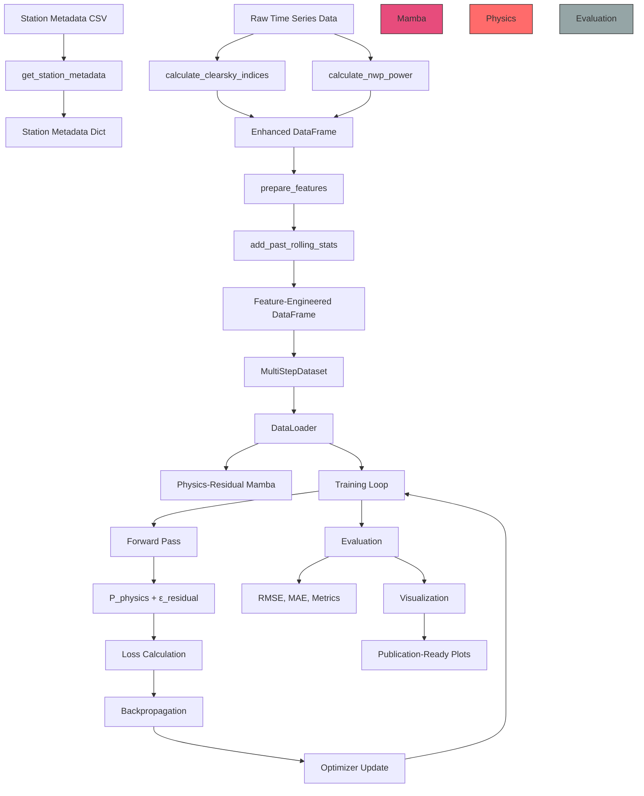
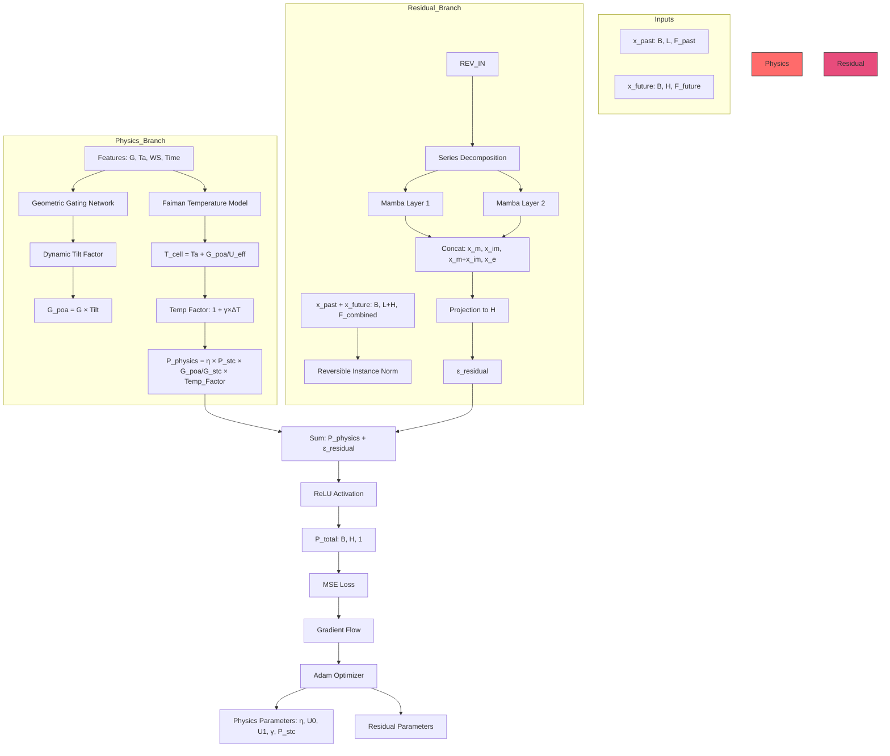

# Physics-Residual Power Mamba: Architecture & Best Practices Report

## Executive Summary

This document provides a comprehensive analysis of the Physics-Residual Power Mamba codebase, including architectural recommendations, refactoring strategy, scientific research assessment, and best practices for production deployment.

**Project Status:** Research prototype with strong technical foundation, requiring modularization and scientific rigor enhancements for publication readiness.

---

## 1. System Architecture

### 1.1 Current Architecture

```
┌─────────────────────────────────────────────────────────────────────┐
│                    physics_residual_mamba.py (2037 lines)          │
│  ┌─────────────────────────────────────────────────────────────┐ │
│  │ Monolithic Implementation (All-in-One)              │ │
│  │                                                        │ │
│  │  Data Loading: Station Metadata, Clear Sky, NWP       │ │
│  │  Data Preprocessing: Rolling Stats, Cyclic Encoding      │ │
│  │  Models: Physics Layer, Mamba, LSTM, Hybrid        │ │
│  │  Training: Epoch Loops, Optimizers, Schedulers        │ │
│  │  Evaluation: RMSE/MAE, Baselines, Metrics          │ │
│  │  Visualization: Plots, Reports, Tables                 │ │
│  │  Configuration: Hyperparameters, Experiment Settings         │ │
│  └─────────────────────────────────────────────────────────────┘ │
└─────────────────────────────────────────────────────────────────────────────┘
```

### 1.2 Proposed Modular Architecture

```
┌─────────────────────────────────────────────────────────────────────────────┐
│                     physics_residual_mamba/ (Package)                │
│  ┌───────────────────────────────────────────────────────────────────┐ │
│  │  configs/ (Configuration Management)                          │ │
│  │  ├── base_config.py         - BaseMambaConfigs         │ │
│  │  ├── physics_config.py       - PhysicsResidualMambaConfigs │ │
│  │  └── hyperparams.py          - Hyperparameter definitions   │ │
│  │                                                           │ │
│  │  data/ (Data Preparation)                                     │ │
│  │  ├── datasets.py            - MultiStepDataset, loaders    │ │
│  │  ├── preprocessing.py        - Feature engineering, rolling stats│ │
│  │  └── station_metadata.py    - Station metadata parsing      │ │
│  │                                                           │ │
│  │  models/ (Model Architectures)                                 │ │
│  │  ├── components.py           - RevIN, series_decomp, moving_avg│ │
│  │  ├── physics_layer.py       - DifferentiablePVLayer, FeatureScaler│ │
│  │  ├── base_models.py         - MMPISSM_Model_01, LSTM, Vanilla│ │
│  │  └── hybrid_model.py         - PhysicsResidualMamba          │ │
│  │                                                           │ │
│  │  losses/ (Loss Functions)                                      │ │
│  │  ├── physics_loss.py         - PhysicsPVLoss (triple-constraint)│ │
│  │  └── base_losses.py          - MSE, MAE, SmoothL1, Huber │ │
│  │                                                           │ │
│  │  training/ (Training Utilities)                                   │ │
│  │  ├── trainers.py            - Training loops, early stopping    │ │
│  │  └── optimizers.py          - Optimizer factories, schedulers  │ │
│  │                                                           │ │
│  │  evaluation/ (Evaluation & Metrics)                             │ │
│  │  ├── evaluators.py         - Model evaluation functions        │ │
│  │  ├── metrics.py              - RMSE, MAE, MAPE, R², NRMSE│ │
│  │  └── baselines.py           - Smart Persistence, NWP calculations│ │
│  │                                                           │ │
│  │  visualization/ (Plotting & Reporting)                          │ │
│  │  ├── plots.py                - Time series, scatter, comparison │ │
│  │  └── reports.py             - Tables, summaries, statistics    │ │
│  │                                                           │ │
│  │  experiments/ (Experiment Orchestration)                        │ │
│  │  ├── cross_validation.py    - CV runners, benchmarks         │ │
│  │  ├── ablation.py             - Ablation study framework       │ │
│  │  └── hyperparameter_tuning.py - Grid search, Optuna       │ │
│  │                                                           │ │
│  │  physics/ (Physics Calculations)                                  │ │
│  │  ├── clearsky.py            - Clear sky index calculations   │ │
│  │  ├── nwp_power.py            - NWP-based power simulation  │ │
│  │  └── pvlib_wrapper.py       - PVLib interface layer       │ │
│  │                                                           │ │
│  │  utils/ (General Utilities)                                       │ │
│  │  ├── random.py               - Seed control, reproducibility  │ │
│  │  ├── device.py              - Device management, CUDA detection  │ │
│  │  └── logging.py             - Logging configuration, formatters  │ │
│  └───────────────────────────────────────────────────────────────────┘ │
└─────────────────────────────────────────────────────────────────────────────────────┘
```

### 1.3 Data Flow Architecture



### 1.4 Model Architecture Diagram



---

## 2. Module Specifications

### 2.1 Configuration Module (`configs/`)

**Purpose:** Centralized hyperparameter and experiment configuration management

```python
# base_config.py
class BaseMambaConfigs:
    """Configuration for baseline Mamba model (no physics)."""
    
    # Sequence Configuration
    seq_len: int = 672           # Past context length
    pred_len: int = 96            # Prediction horizon (24h @ 15min)
    
    # Model Architecture
    n_embed: int = 128            # Mamba embedding dimension
    d_state: int = 64             # Mamba state dimension
    dconv: int = 2                # Convolution kernel size
    e_fact: int = 2                # Expansion factor
    
    # Training Configuration
    n_splits: int = 4              # Cross-validation folds
    batch_size: int = 64           # Batch size
    epochs: int = 50               # Training epochs
    dropout: float = 0.2            # Dropout rate
    
    # Device
    device: torch.device = torch.device("cuda" if torch.cuda.is_available() else "cpu")
    
    # Feature Configuration
    PAST_INPUT_COLS: List[str] = [...]    # Past feature columns
    FUTURE_INPUT_COLS: List[str] = [...]   # Future feature columns
    TARGET_COL: List[str] = ['power']      # Target variable
```

```python
# physics_config.py
class PhysicsResidualMambaConfigs:
    """Configuration for Physics-Residual Mamba hybrid model."""
    
    # Inherits all BaseMambaConfigs attributes
    # Additional Physics Configuration
    T_ref: float = 25.0          # Reference temperature (°C)
    G_night_thr: float = 10.0    # Night irradiance threshold (W/m²)
    
    # Physics Loss Weights
    lambda_data: float = 1.0       # Data fit loss weight
    lambda_night: float = 0.2     # Night penalty weight
    lambda_mono: float = 0.1      # Monotonicity weight
    
    # Physics Layer Parameters (initial values)
    eta_init: float = 0.15         # Initial efficiency
    P_stc_init: float = 18.0       # Initial STC power (MW)
    gamma_init: float = -5.4        # Initial temperature coefficient
    U0_init: float = 3.2           # Initial heat transfer coeff
    U1_init: float = 1.9           # Initial wind cooling coeff
```

```python
# hyperparams.py
class HyperparamRegistry:
    """Registry of hyperparameters for systematic search."""
    
    # Learning Rates
    LEARNING_RATES: List[float] = [1e-4, 5e-4, 1e-3, 5e-3, 1e-2]
    
    # Lambda Weights (Physics Loss)
    LAMBDA_DATA: List[float] = [0.5, 0.8, 1.0, 1.2]
    LAMBDA_NIGHT: List[float] = [0.1, 0.2, 0.3, 0.4]
    LAMBDA_MONO: List[float] = [0.05, 0.1, 0.15, 0.2]
    
    # Sequence Lengths
    SEQ_LENS: List[int] = [96, 192, 384, 672, 960]
    
    # Mamba Hyperparameters
    D_STATES: List[int] = [64, 96, 128, 192]
    D_CONVS: List[int] = [2, 4, 6, 8]
    E_FACTS: List[int] = [2, 3, 4]
    
    @classmethod
    def get_grid(cls) -> Dict[str, List]:
        """Generate full hyperparameter grid for grid search."""
        return {
            'learning_rate': cls.LEARNING_RATES,
            'lambda_data': cls.LAMBDA_DATA,
            'lambda_night': cls.LAMBDA_NIGHT,
            'lambda_mono': cls.LAMBDA_MONO,
            'seq_len': cls.SEQ_LENS,
            'd_state': cls.D_STATES,
            'd_conv': cls.D_CONVS,
            'e_fact': cls.E_FACTS
        }
```

### 2.2 Data Module (`data/`)

**Purpose:** Data loading, preprocessing, and dataset creation

```python
# datasets.py
class MultiStepDataset(Dataset):
    """
    Multi-step forecasting dataset for solar power prediction.
    
    Returns:
        x_past:   [seq_len, F_past]   - Past context features
        y_future: [pred_len, 1]        - Future target power
        x_future: [pred_len, F_future]  - Future weather features
        b_future: [pred_len, 2]        - Baseline data [NWP, P_CLR]
        b_last:   [2]                    - Last step data [power_last, P_CLR_last]
    
    Example:
        >>> dataset = MultiStepDataset(X, Y, P, Bf, Bl, seq_len=96, pred_len=96)
        >>> x_past, y_future, x_future, b_future, b_last = dataset[0]
    """
    
    def __init__(
        self,
        X: np.ndarray,
        Y: np.ndarray,
        P: np.ndarray,
        Bf: np.ndarray,
        Bl: np.ndarray,
        seq_len: int = 96,
        pred_len: int = 96
    ):
        self.X = X
        self.y = Y
        self.P = P
        self.Bf = Bf
        self.Bl = Bl
        self.seq_len = seq_len
        self.pred_len = pred_len
    
    def __len__(self) -> int:
        return len(self.X) - self.seq_len - self.pred_len + 1
    
    def __getitem__(self, idx: int) -> Tuple:
        x_past = self.X[idx:idx + self.seq_len]
        y_future = self.y[idx + self.seq_len:idx + self.seq_len + self.pred_len]
        x_future = self.P[idx + self.seq_len:idx + self.seq_len + self.pred_len]
        b_future = self.Bf[idx + self.seq_len:idx + self.seq_len + self.pred_len]
        b_last = self.Bl[idx + self.seq_len - 1]
        
        return (
            torch.tensor(x_past, dtype=torch.float32),
            torch.tensor(y_future, dtype=torch.float32),
            torch.tensor(x_future, dtype=torch.float32),
            torch.tensor(b_future, dtype=torch.float32),
            torch.tensor(b_last, dtype=torch.float32),
        )
```

```python
# preprocessing.py
def prepare_features(df: pd.DataFrame) -> pd.DataFrame:
    """
    Add cyclic time encodings and rolling statistics.
    
    Features Added:
        - Cyclic: hour_sin, hour_cos, day_sin, day_cos, 
                 month_sin, month_cos, season_sin, season_cos
        - Rolling: power_mean_3h, power_std_3h, 
                  power_mean_5h, power_std_5h,
                  lmd_totalirrad_mean_3h, lmd_temperature_mean_3h, etc.
    
    Args:
        df: DataFrame with datetime index
        
    Returns:
        DataFrame with engineered features
        
    Example:
        >>> df = prepare_features(station_data)
        >>> print(df.columns.tolist())
        [..., 'hour_sin', 'hour_cos', 'power_mean_3h', ...]
    """
    data = df.copy()
    
    # Cyclic encodings (preserves circular nature)
    data['hour_sin'] = np.sin(2 * np.pi * data.index.hour / 24)
    data['hour_cos'] = np.cos(2 * np.pi * data.index.hour / 24)
    data['day_sin'] = np.sin(2 * np.pi * data.index.dayofyear / 365)
    data['day_cos'] = np.cos(2 * np.pi * data.index.dayofyear / 365)
    data['month_sin'] = np.sin(2 * np.pi * data.index.month / 12)
    data['month_cos'] = np.cos(2 * np.pi * data.index.month / 12)
    data['season_sin'] = np.sin(2 * np.pi * data.index.month / 4)
    data['season_cos'] = np.cos(2 * np.pi * data.index.month / 4)
    
    return data

def add_past_rolling_stats(
    df: pd.DataFrame,
    hours_list: List[int] = [3, 5, 8],
    cols: List[str] = ["power", "lmd_totalirrad", "lmd_temperature", "lmd_windspeed"],
    freq_minutes: int = 15,
    use_time_based: bool = True,
    fill_value: float = 0.0
) -> pd.DataFrame:
    """
    Add causal (past-only) rolling statistics.
    
    Key Features:
        - Causal: Uses shift(1) to prevent data leakage
        - Time-based: Uses '3H', '5H', '8H' windows when DatetimeIndex
        - Robust: Handles initial rows with fill_value
        - Configurable: Flexible hours_list and columns
    
    Args:
        df: Input DataFrame
        hours_list: Rolling window sizes in hours
        cols: Columns to compute statistics for
        freq_minutes: Data frequency (default 15min)
        use_time_based: Use time-based rolling if DatetimeIndex
        fill_value: Value for initial rows (default 0.0)
        
    Returns:
        DataFrame with rolling mean/std columns
        
    Example:
        >>> df = add_past_rolling_stats(data, [3, 5, 8], ["power"])
        >>> print(df.columns.tolist())
        [..., 'power_mean_3h', 'power_std_3h', 'power_mean_5h', 'power_std_5h', ...]
    """
    out = df.copy()
    
    # Determine if time-based rolling is possible
    if use_time_based and isinstance(out.index, pd.DatetimeIndex):
        dt_indexed = True
        idx_df = out
    else:
        dt_indexed = False
        idx_df = out
    
    for col in cols:
        if col not in idx_df.columns:
            raise KeyError(f"Column '{col}' not found in df.")
        
        s = idx_df[col].astype("float32")
        s_past = s.shift(1)  # Causal: only past values
        
        for h in hours_list:
            if dt_indexed:
                win = f"{int(h)}H"
                mean = s_past.rolling(win, min_periods=1).mean()
                std = s_past.rolling(win, min_periods=1).std(ddof=0)
            else:
                steps = int((h * 60) / freq_minutes)
                mean = s_past.rolling(window=steps, min_periods=1).mean()
                std = s_past.rolling(window=steps, min_periods=1).std(ddof=0)
            
            mean_name = f"{col}_mean_{h}h"
            std_name = f"{col}_std_{h}h"
            idx_df[mean_name] = mean.fillna(fill_value)
            idx_df[std_name] = std.fillna(fill_value)
    
    # Restore original index if needed
    if use_time_based and not isinstance(out.index, pd.DatetimeIndex):
        # Merge back to original DataFrame
        out = out.merge(idx_df, left_index=True, right_index=True)
        out[mean_name] = out[mean_name].fillna(fill_value)
        out[std_name] = out[std_name].fillna(fill_value)
    
    return out if dt_indexed else idx_df
```

```python
# station_metadata.py
def get_station_metadata(station_num: int, df: pd.DataFrame) -> Dict[str, Any]:
    """
    Parse station metadata from CSV.
    
    Extracted Fields:
        - Identity: Station_ID, Latitude, Longitude
        - System: Capacity, Panel Size, Panel Number, PV Technology
        - Module: Pmax, Vmpp, Impp
        - Inverter: Rated Power, Max DC Voltage, Max DC Current
        - Layout: Modules per String, Strings per Inverter
        - Array: Tilt (extracted from string like "South 30")
    
    Args:
        station_num: Station number (0-9)
        df: Metadata DataFrame
        
    Returns:
        Dictionary with parsed numeric values
        
    Example:
        >>> metadata = get_station_metadata(7, metadata_df)
        >>> print(metadata['Capacity'])
        20.0  # MW
    """
    station_id_str = f"station{str(station_num).zfill(2)}"
    station_row = df[df['Station_ID'] == station_id_str]
    
    if station_row.empty:
        raise ValueError(f"Station ID {station_id_str} not found")
    
    row = station_row.iloc[0]
    
    # Helper functions
    def parse_kv_string(text_block: str) -> Dict[str, str]:
        """Parse 'Key:Value' blocks."""
        data = {}
        if isinstance(text_block, str):
            for item in text_block.split('\n'):
                if ':' in item:
                    k, v = item.split(':', 1)
                    data[k.strip()] = v.strip()
        return data
    
    def extract_num(val: Any, default: float = 0.0) -> float:
        """Extract numeric value from string."""
        if pd.isna(val):
            return default
        match = re.search(r"[-+]?\d*\.\d+|\d+", str(val))
        return float(match.group()) if match else default
    
    # Parse complex columns
    module_items = parse_kv_string(row.get('Module', ''))
    inverter_items = parse_kv_string(row.get('Inverters', ''))
    layout_items = parse_kv_string(row.get('Layout', ''))
    
    # Build clean dictionary
    metadata = {
        'Station_ID': station_id_str,
        'Latitude': float(row['Latitude']),
        'Longitude': float(row['Longitude']),
        'Array_Tilt': row['Array_Tilt'],  # Keep as string for parsing
        'Capacity': float(row['Capacity']),
        'Panel_Size': float(row.get('Panel_Size', 1.62)),
        'Total_Panel_Number': int(row.get('Panel_Number', 0)),
        'PV_Technology': row['PV_Technology'],
        'Module_Pmax': extract_num(module_items.get('Pmax'), default=250),
        'Module_Vmpp': extract_num(module_items.get('Vmpp'), default=30),
        'Module_Impp': extract_num(module_items.get('Impp'), default=8),
        'Inverter_Rated_Power': extract_num(inverter_items.get('Rated power'), default=500),
        'Inverter_Max_DC_Voltage': extract_num(inverter_items.get('Max. DC voltage'), default=1000),
        'Modules_per_String': int(extract_num(layout_items.get('modules per string'), default=20)),
        'Strings_per_Inverter': int(extract_num(layout_items.get('strings per inverter'), default=100)),
    }
    
    return metadata
```

### 2.3 Models Module (`models/`)

**Purpose:** Model architectures and neural components

```python
# components.py
class RevIN(nn.Module):
    """
    Reversible Instance Normalization.
    
    Removes need for model to learn different "rules" for Summer vs. Winter.
    Normalizes each input window individually using instance mean/std.
    
    Key Features:
        - Instance-based normalization (local, not global)
        - Learnable affine parameters (γ, β) for adaptation
        - Reversible denormalization for accurate reconstruction
    
    Args:
        num_features: Number of input features/channels
        eps: Numerical stability constant (default 1e-3)
        affine: Whether to use learnable affine parameters
        
    Example:
        >>> revin = RevIN(num_features=64, eps=1e-3, affine=True)
        >>> x_norm = revin(x, mode='norm')
        >>> x_recon = revin(x_norm, mode='denorm')
    """
    
    def __init__(self, num_features: int, eps: float = 1e-3, affine: bool = True):
        super().__init__()
        self.num_features = num_features
        self.eps = eps
        self.affine = affine
        
        if self.affine:
            self.affine_weight = nn.Parameter(torch.ones(num_features))
            self.affine_bias = nn.Parameter(torch.zeros(num_features))
    
    def forward(self, x: torch.Tensor, mode: str) -> torch.Tensor:
        if mode == 'norm':
            self._get_statistics(x)
            x = self._normalize(x)
        elif mode == 'denorm':
            x = self._denormalize(x)
        else:
            raise NotImplementedError(f"Mode '{mode}' not implemented")
        
        return x
    
    def _get_statistics(self, x: torch.Tensor) -> None:
        dim2reduce = tuple(range(1, x.ndim - 1))
        self.mean = torch.mean(x, dim=dim2reduce, keepdim=True).detach()
        variance = torch.var(x, dim=dim2reduce, keepdim=True, unbiased=False)
        self.stdev = torch.sqrt(variance + self.eps).detach()
    
    def _normalize(self, x: torch.Tensor) -> torch.Tensor:
        x = x - self.mean
        x = x / self.stdev
        if self.affine:
            x = x * self.affine_weight
            x = x + self.affine_bias
        return x
    
    def _denormalize(self, x: torch.Tensor) -> torch.Tensor:
        if self.affine:
            x = x - self.affine_bias
            x = x / (self.affine_weight + self.eps)
        x = x * self.stdev
        x = x + self.mean
        return x

class moving_avg(nn.Module):
    """
    Moving average block for trend extraction.
    
    Highlights low-frequency trends in time series.
    Used in series decomposition to separate trend from residual.
    
    Args:
        kernel_size: Size of moving average window
        stride: Step size for convolution
        
    Example:
        >>> ma = moving_avg(kernel_size=25, stride=1)
        >>> trend = ma(x)  # Smoothed trend component
    """
    
    def __init__(self, kernel_size: int, stride: int = 1):
        super().__init__()
        self.kernel_size = kernel_size
        self.avg = nn.AvgPool1d(kernel_size=kernel_size, stride=stride, padding=0)
    
    def forward(self, x: torch.Tensor) -> torch.Tensor:
        # Pad front and back with edge values
        front = x[:, 0:1, :].repeat(1, (self.kernel_size - 1) // 2, 1)
        end = x[:, -1:, :].repeat(1, (self.kernel_size - 1) // 2, 1)
        x = torch.cat([front, x, end], dim=1)
        
        # Apply moving average
        x = self.avg(x.permute(0, 2, 1))
        return x.permute(0, 2, 1)

class series_decomp(nn.Module):
    """
    Series decomposition block.
    
    Separates time series into:
        - Trend: Low-frequency component (via moving average)
        - Residual: High-frequency component (original - trend)
    
    Used before Mamba to handle seasonal vs. non-seasonal patterns.
    
    Args:
        kernel_size: Window size for moving average
        
    Example:
        >>> decomp = series_decomp(kernel_size=25)
        >>> residual, trend = decomp(x)
    """
    
    def __init__(self, kernel_size: int):
        super().__init__()
        self.moving_avg = moving_avg(kernel_size, stride=1)
    
    def forward(self, x: torch.Tensor) -> Tuple[torch.Tensor, torch.Tensor]:
        moving_mean = self.moving_avg(x)
        residual = x - moving_mean
        return residual, moving_mean
```

```python
# physics_layer.py
class FeatureScaler(nn.Module):
    """
    Feature scaler for physics layer denormalization.
    
    Stores normalization statistics and provides denormalization
    for physics equations requiring real-world units:
        - Irradiance G: 0-1200 W/m²
        - Temperature T: -20 to 50 °C
        - Wind Speed W: 0-20 m/s
    
    Key Features:
        - Registered buffers (move with model to GPU/CPU)
        - Per-feature mean/std storage
        - Denormalization methods
        - Statistics export for logging
        
    Args:
        feature_means: Dict mapping feature name to mean value
        feature_stds: Dict mapping feature name to std value
        
    Example:
        >>> means = {'nwp_globalirrad': 300.0, 'nwp_temperature': 15.0}
        >>> stds = {'nwp_globalirrad': 250.0, 'nwp_temperature': 10.0}
        >>> scaler = FeatureScaler(means, stds)
        >>> G_denorm = scaler.denormalize_feature(G_norm, 'nwp_globalirrad')
    """
    
    def __init__(self, feature_means: Dict[str, float], feature_stds: Dict[str, float]):
        super().__init__()
        self.feature_names = list(feature_means.keys())
        
        # Register buffers for each feature
        for name in self.feature_names:
            mean_val = feature_means[name]
            std_val = feature_stds[name]
            # Ensure std is never zero
            if std_val == 0:
                std_val = 1.0
            self.register_buffer(f'{name}_mean', torch.tensor(mean_val, dtype=torch.float32))
            self.register_buffer(f'{name}_std', torch.tensor(std_val, dtype=torch.float32))
    
    def denormalize_feature(self, x_norm: torch.Tensor, feature_name: str) -> torch.Tensor:
        """Denormalize a single feature tensor."""
        mean = getattr(self, f'{feature_name}_mean')
        std = getattr(self, f'{feature_name}_std')
        return x_norm * std + mean
    
    def denormalize_dict(self, x_norm: torch.Tensor, feature_indices: Dict[str, int]) -> Dict[str, torch.Tensor]:
        """Denormalize multiple features from tensor."""
        result = {}
        for name, idx in feature_indices.items():
            if name in self.feature_names:
                result[name] = self.denormalize_feature(x_norm[..., idx], name)
            else:
                # If feature not in scaler, pass through unchanged
                result[name] = x_norm[..., idx]
        return result
    
    def get_stats(self) -> Dict[str, Dict[str, float]]:
        """Return all stored statistics as plain dict for logging."""
        return {
            name: {
                'mean': getattr(self, f'{name}_mean').item(),
                'std': getattr(self, f'{name}_std').item()
            }
            for name in self.feature_names
        }

class DifferentiablePVLayer(nn.Module):
    """
    Differentiable Physics Layer for PV Power Estimation.
    
    Combines:
        1. Faiman Temperature Model: T_cell = T_air + G_poa / (U0 + U1×WS)
        2. Geometric Gating: Learns AOI correction from time features
        3. PV Power Model: P = η × P_stc × (G_poa/G_stc) × (1 + γ×(T_cell - T_ref))
    
    Key Features:
        - Learnable physics parameters (η, U0, U1, γ, P_stc)
        - Geometric gating network for AOI correction
        - Differentiable through entire pipeline
        - ReLU output ensures non-negative power
    
    Args:
        idx_G: Index of global irradiance in x_future
        idx_Ta: Index of air temperature in x_future
        idx_WS: Index of wind speed in x_future
        idx_time_feats: Indices of time features [hour_sin, hour_cos, season_sin, season_cos]
        T_ref: Reference temperature (default 25°C)
        G_stc: STC irradiance (default 1000 W/m²)
        P_stc_init: Initial STC power in MW (default 18MW)
        eta_init: Initial efficiency (default 0.15)
        
    Example:
        >>> physics_layer = DifferentiablePVLayer(
        ...     idx_G=0, idx_Ta=1, idx_WS=2,
        ...     idx_time_feats=[3, 4, 5, 6],
        ...     T_ref=25.0, G_stc=1000.0, P_stc_init=18.0, eta_init=0.15
        >>> )
        >>> p_physics = physics_layer(x_future)
    """
    
    def __init__(
        self,
        idx_G: int,
        idx_Ta: int,
        idx_WS: int,
        idx_time_feats: List[int],
        T_ref: float = 25.0,
        G_stc: float = 1000.0,
        P_stc_init: float = 18.0,
        eta_init: float = 0.15
    ):
        super().__init__()
        self.idx_G, self.idx_Ta, self.idx_WS = idx_G, idx_Ta, idx_WS
        self.idx_time_feats = idx_time_feats
        self.T_ref, self.G_stc = float(T_ref), float(G_stc)
        self.eps = 1e-6
        
        # Learnable physics parameters
        # Temperature coefficient (Poly-Si: ~ -0.45%/°C)
        self.gamma_raw = nn.Parameter(torch.tensor(-5.4, dtype=torch.float32))
        
        # Heat transfer coefficients (open rack)
        self.U0_raw = nn.Parameter(torch.tensor(3.2, dtype=torch.float32))
        self.U1_raw = nn.Parameter(torch.tensor(1.9, dtype=torch.float32))
        
        # Efficiency and capacity
        self.eta_raw = nn.Parameter(torch.tensor(-1.7, dtype=torch.float32))
        self.Pstc_raw = nn.Parameter(torch.tensor(float(P_stc_init)), dtype=torch.float32)
        
        # Geometric gating network
        self.geo_net = nn.Sequential(
            nn.Linear(len(idx_time_feats), 16),
            nn.Tanh(),
            nn.Linear(16, 1),
            nn.Softplus()  # Factor must be positive
        )
    
    def forward(self, x_future: torch.Tensor) -> torch.Tensor:
        # Extract physics inputs
        G = x_future[:, :, self.idx_G]
        Ta = x_future[:, :, self.idx_Ta]
        WS = x_future[:, :, self.idx_WS]
        time_feats = x_future[:, :, self.idx_time_feats]
        
        # Compute dynamic tilt factor via geometric gating
        tilt_factor = self.geo_net(time_feats).squeeze(-1)
        
        # Effective plane-of-array irradiance
        G_poa = G * tilt_factor
        
        # Enforce constraints
        U0 = F.softplus(self.U0_raw)
        U1 = F.softplus(self.U1_raw)
        eta = torch.sigmoid(self.eta_raw)
        gamma = -F.softplus(self.gamma_raw)  # Ensure negative
        P_stc = F.softplus(self.Pstc_raw)
        
        # Faiman temperature model
        T_cell = Ta + G_poa / (U0 + U1 * WS + self.eps)
        
        # Power calculation
        delta_T = T_cell - self.T_ref
        temp_factor = 1.0 + gamma * delta_T
        
        P_phys = eta * P_stc * (G_poa / self.G_stc) * temp_factor
        
        return F.relu(P_phys).unsqueeze(-1)
    
    def get_params_dict(self) -> Dict[str, float]:
        """Return learned parameters for monitoring."""
        with torch.no_grad():
            return {
                'eta': torch.sigmoid(self.eta_raw).item(),
                'U0': F.softplus(self.U0_raw).item(),
                'U1': F.softplus(self.U1_raw).item(),
                'gamma': -F.softplus(self.gamma_raw).item(),
                'P_stc': F.softplus(self.Pstc_raw).item()
            }
```

```python
# base_models.py
class MMPISSM_Model_01(nn.Module):
    """
    Base Mamba model (Power Mamba architecture).
    
    Architecture:
        1. Input construction with shadow features
        2. RevIN normalization (encoder and main)
        3. Series decomposition (trend + residual)
        4. Dual Mamba branches
        5. Multi-head fusion
        6. Projection to prediction horizon
    
    Key Features:
        - Shadow features: Future NWP aligned with past features
        - Reversible normalization for seasonal invariance
        - Series decomposition for trend/residual separation
        - Dual Mamba for multi-scale processing
        - Learnable projection layers
        
    Args:
        configs: Configuration object with all hyperparameters
        
    Example:
        >>> model = MMPISSM_Model_01(configs)
        >>> p_pred = model(x_past, x_future)
    """
    
    def __init__(self, configs):
        super().__init__()
        self.configs = configs
        
        # Dimensions
        self.num_past_feats = len(configs.PAST_INPUT_COLS)
        self.num_shadows = len(configs.common_features)
        self.enc_in = self.num_past_feats + self.num_shadows
        
        # Pre-calculate indices
        self.fut_indices = torch.tensor(
            [configs.FUTURE_INPUT_COLS.index(f) for f in configs.common_features],
            dtype=torch.long
        )
        self.past_target_indices = torch.tensor(
            [configs.PAST_INPUT_COLS.index(f) for f in configs.common_features],
            dtype=torch.long
        )
        self.shadow_start_idx = self.num_past_feats
        self.target_indices = [configs.PAST_INPUT_COLS.index(col) for col in configs.TARGET_COL]
        
        # Projections
        self.lin1 = nn.Linear(2 * (configs.seq_len + configs.pred_len), configs.seq_len)
        self.lin2 = nn.Linear(2 * configs.seq_len, configs.n_embed)
        self.lin3 = nn.Linear(4 * configs.n_embed, configs.pred_len)
        
        # Components
        self.decomposition = series_decomp(configs.kernel_size)
        self.revin_layer = RevIN(self.enc_in)
        self.revin_layer_enc = RevIN(self.enc_in)
        self.dropout1 = nn.Dropout(configs.dropout)
        self.dropout2 = nn.Dropout(configs.dropout)
        
        # Mamba layers
        if MAMBA_AVAILABLE:
            self.mamba1 = Mamba(
                d_model=configs.n_embed,
                d_state=configs.d_state,
                d_conv=configs.dconv,
                expand=configs.e_fact
            )
            self.mamba2 = Mamba(
                d_model=self.enc_in,
                d_state=configs.d_state,
                d_conv=configs.dconv,
                expand=configs.e_fact
            )
        else:
            self.mamba1 = nn.Identity()
            self.mamba2 = nn.Identity()
    
    def forward(self, x: torch.Tensor, x_f: torch.Tensor) -> torch.Tensor:
        B = x.size(0)
        device = x.device
        L = self.configs.seq_len
        H = self.configs.pred_len
        
        # Ensure indices on correct device
        if self.fut_indices.device != device:
            self.fut_indices = self.fut_indices.to(device)
            self.past_target_indices = self.past_target_indices.to(device)
        
        # Input construction with shadow features
        total_len = L + H
        x_pred = torch.zeros(B, total_len, self.enc_in, device=device)
        
        # Fill past data
        x_pred[:, :L, :self.num_past_feats] = x
        
        # Extract and write shadow forecasts
        shadow_forecasts = torch.index_select(x_f, 2, self.fut_indices)
        
        # Write forecasts into future part
        for i, past_idx in enumerate(self.past_target_indices):
            x_pred[:, L:, past_idx] = shadow_forecasts[:, :, i]
        
        # Shadow columns (future part)
        x_pred[:, L:, self.shadow_start_idx:] = shadow_forecasts
        
        # Shadow columns (past part)
        for i, past_idx in enumerate(self.past_target_indices):
            shadow_col = self.shadow_start_idx + i
            x_pred[:, :L, shadow_col] = x_pred[:, -L:, past_idx]
        
        # Standard PowerMamba processing
        x = x_pred
        
        # Encoder normalization
        x = self.revin_layer_enc(x, 'norm')
        seasonal_init, trend_init = self.decomposition(x)
        x = torch.cat([seasonal_init, trend_init], dim=1)
        
        x = torch.permute(x, (0, 2, 1))
        x = self.lin1(x)
        x = torch.permute(x, (0, 2, 1))
        x = self.revin_layer_enc(x, 'denorm')
        
        # Main processing
        x = self.revin_layer(x, 'norm')
        seasonal_init, trend_init = self.decomposition(x)
        x_e = torch.cat([seasonal_init, trend_init], dim=1)
        x_e = torch.permute(x_e, (0, 2, 1))
        x_e = self.lin2(x_e)
        
        x_m = self.dropout1(x_e)
        x_m = self.mamba1(x_m)
        
        x_im = self.dropout2(x_e)
        x_im = torch.permute(x_im, (0, 2, 1))
        x_im = self.mamba2(x_im)
        x_im = torch.permute(x_im, (0, 2, 1))
        
        # Multi-head fusion
        x = torch.cat([x_im, x_m, x_m + x_im, x_e], dim=2)
        
        x = self.lin3(x)
        x = torch.permute(x, (0, 2, 1))
        x = self.revin_layer(x, 'denorm')
        
        # Return only target columns
        return x[:, :, self.target_indices]

class VanillaLSTM(nn.Module):
    """
    Standard LSTM encoder-decoder for solar forecasting.
    
    Architecture:
        1. LSTM encoder for past context
        2. Linear decoder for future prediction
        3. Dropout for regularization
    
    Key Features:
        - Classical baseline for comparison
        - Simple architecture (easier to interpret)
        - Faster training than Mamba for small datasets
        
    Args:
        configs: Configuration object
        
    Example:
        >>> model = VanillaLSTM(configs)
        >>> p_pred = model(x_past, x_future)
    """
    
    def __init__(self, configs):
        super().__init__()
        self.configs = configs
        self.enc_in = len(configs.PAST_INPUT_COLS)
        self.pred_len = configs.pred_len
        
        # LSTM encoder
        self.lstm = nn.LSTM(
            input_size=self.enc_in,
            hidden_size=128,
            num_layers=2,
            dropout=0.2,
            batch_first=True
        )
        
        # Decoder
        self.decoder = nn.Linear(128, configs.pred_len)
        self.dropout = nn.Dropout(0.2)
    
    def forward(self, x: torch.Tensor, x_f: torch.Tensor) -> torch.Tensor:
        # Encode past context
        _, (h_n, c_n) = self.lstm(x)
        
        # Use last hidden state
        h_last = h_n[:, -1, :]
        c_last = c_n[:, -1, :]
        
        # Decode to prediction horizon
        pred = self.decoder(h_last)
        pred = self.dropout(pred)
        
        return pred.unsqueeze(-1)

class VanillaMamba(nn.Module):
    """
    Vanilla Mamba (no RevIN, no decomposition).
    
    Architecture:
        1. Linear embedding
        2. Single Mamba layer
        3. Linear projection
    
    Key Features:
        - Minimal architecture for ablation studies
        - Faster training than full PowerMamba
        - Baseline for component analysis
        
    Args:
        configs: Configuration object
        
    Example:
        >>> model = VanillaMamba(configs)
        >>> p_pred = model(x_past, x_future)
    """
    
    def __init__(self, configs):
        super().__init__()
        self.configs = configs
        self.enc_in = len(configs.PAST_INPUT_COLS)
        self.pred_len = configs.pred_len
        self.d_model = 128
        
        # Architecture
        self.embedding = nn.Linear(self.enc_in, self.d_model)
        
        if MAMBA_AVAILABLE:
            self.mamba = Mamba(
                d_model=self.d_model,
                d_state=configs.d_state,
                d_conv=configs.dconv,
                expand=configs.e_fact
            )
        else:
            self.mamba = nn.Identity()
        
        self.projection = nn.Linear(self.d_model, configs.pred_len)
    
    def forward(self, x: torch.Tensor, x_f: torch.Tensor) -> torch.Tensor:
        B = x.size(0)
        device = x.device
        
        # Simple input construction (no shadow features)
        x_in = x
        
        # Embedding
        x = self.embedding(x_in)
        
        # Mamba processing
        x = self.mamba(x)
        
        # Projection
        pred = self.projection(x)
        
        return pred.unsqueeze(-1)
```

```python
# hybrid_model.py
class PhysicsResidualMamba(nn.Module):
    """
    Physics-Residual Power Mamba: Hybrid architecture.
    
    Combines:
        1. Physics Branch: DifferentiablePVLayer (Faiman + Geometric Gating)
        2. Residual Branch: MMPISSM_Model_01 (Mamba + RevIN + Decomposition)
        3. Combination: P_total = ReLU(P_physics + ε_residual)
    
    Key Innovation:
        - Physics constrains learning space (reduces overfitting)
        - Residual learner corrects physics model errors
        - Learnable physics parameters (domain knowledge integration)
        - Geometric gating handles AOI correction automatically
        
    Args:
        configs: Configuration object with all hyperparameters
        
    Example:
        >>> model = PhysicsResidualMamba(configs)
        >>> p_total, p_physics = model(x_past, x_future)
    """
    
    def __init__(self, configs):
        super().__init__()
        self.configs = configs
        
        # Get indices for physics layer
        idx_G = configs.FUTURE_INPUT_COLS.index('nwp_globalirrad')
        idx_Ta = configs.FUTURE_INPUT_COLS.index('nwp_temperature')
        idx_WS = configs.FUTURE_INPUT_COLS.index('nwp_windspeed')
        
        # Detect time features for geometric gating
        idx_time_feats = []
        possible_feats = ['hour_sin', 'hour_cos', 'season_sin', 'season_cos']
        for f in possible_feats:
            if f in configs.FUTURE_INPUT_COLS:
                idx_time_feats.append(configs.FUTURE_INPUT_COLS.index(f))
        
        if len(idx_time_feats) == 0:
            print("WARNING: Time features not found. Geometric Gating might fail.")
        
        # Branch A: Physics Layer
        self.physics_layer = DifferentiablePVLayer(
            idx_G=idx_G, idx_Ta=idx_Ta, idx_WS=idx_WS,
            idx_time_feats=idx_time_feats,
            T_ref=configs.T_ref,
            G_stc=1000.0,
            P_stc_init=18.0,
            eta_init=0.15
        )
        
        # Branch B: Residual Learner (output_residual=True)
        self.mamba_model = MMPISSM_Model_01(configs, output_residual=True)
    
    def forward(self, x_past: torch.Tensor, x_future: torch.Tensor) -> Tuple[torch.Tensor, torch.Tensor]:
        """
        Forward pass combining physics and residual predictions.
        
        Args:
            x_past: Past input features [B, L, F_past]
            x_future: Future input features [B, H, F_future]
            
        Returns:
            p_total: Combined prediction [B, H, 1]
            p_physics: Physics-only prediction [B, H, 1]
        """
        # NaN guard
        if torch.isnan(x_past).any() or torch.isinf(x_past).any():
            x_past = torch.nan_to_num(x_past, nan=0.0, posinf=0.0, neginf=0.0)
        
        if torch.isnan(x_future).any() or torch.isinf(x_future).any():
            x_future = torch.nan_to_num(x_future, nan=0.0, posinf=0.0, neginf=0.0)
        
        # Branch A: Physics-based prediction
        p_physics = self.physics_layer(x_future)  # [B, H, 1]
        
        # Check physics output
        if torch.isnan(p_physics).any() or torch.isinf(p_physics).any():
            p_physics = torch.nan_to_num(p_physics, nan=0.0, posinf=0.0, neginf=0.0)
        
        # Branch B: Residual prediction via Mamba
        p_residual = self.mamba_model(x_past, x_future)  # [B, H, 1]
        
        # Check residual output
        if torch.isnan(p_residual).any() or torch.isinf(p_residual).any():
            p_residual = torch.nan_to_num(p_residual, nan=0.0, posinf=0.0, neginf=0.0)
        
        # Combination: Sum physics and residual, apply ReLU
        p_total = F.relu(p_physics + p_residual)  # [B, H, 1]
        
        return p_total, p_physics
```

### 2.4 Losses Module (`losses/`)

**Purpose:** Loss functions for model training

```python
# physics_loss.py
class PhysicsPVLoss(nn.Module):
    """
    Triple-constraint Physics-Informed Loss.
    
    Components:
        1. Data Fit Loss (MSE): Standard prediction accuracy
        2. Night-time Penalty: Forces P → 0 when G < G_night_thr
        3. Monotonicity Regularization: Penalizes P decreasing when G increasing
    
    Total Loss:
        L = λ_data × L_data + λ_night × L_night + λ_mono × L_mono
    
    Args:
        configs: Configuration object
        future_cols_order: Order of columns in x_future tensor
        lambda_data: Weight for data fit (default 1.0)
        lambda_night: Weight for night penalty (default 0.2)
        lambda_mono: Weight for monotonicity (default 0.1)
        
    Example:
        >>> criterion = PhysicsPVLoss(configs, future_cols_order)
        >>> loss, logs = criterion(preds, y_true, x_future)
        >>> print(f"L_data={logs['L_data']:.4f}, L_night={logs['L_night']:.4f}")
    """
    
    def __init__(
        self,
        configs,
        future_cols_order: List[str],
        lambda_data: float = 1.0,
        lambda_night: float = 0.2,
        lambda_mono: float = 0.1
    ):
        super().__init__()
        self.cfg = configs
        
        # Feature indices
        self.idx_G = future_cols_order.index('nwp_globalirrad')
        self.idx_Ta = future_cols_order.index('nwp_temperature')
        self.idx_WS = future_cols_order.index('nwp_windspeed')
        
        self.lambda_data = lambda_data
        self.lambda_night = lambda_night
        self.lambda_mono = lambda_mono
        self.eps = 1e-6
    
    def forward(
        self,
        preds: torch.Tensor,
        y_true: torch.Tensor,
        x_future: torch.Tensor
    ) -> Tuple[torch.Tensor, Dict[str, float]]:
        """
        Compute triple-constraint loss.
        
        Args:
            preds: Model predictions [B, H, 1]
            y_true: Ground truth [B, H, 1]
            x_future: Future weather features [B, H, F_future]
            
        Returns:
            total_loss: Weighted sum of all components
            loss_dict: Individual component values for logging
        """
        # 1. Data fit loss (MSE)
        L_data = F.mse_loss(preds, y_true)
        
        # 2. Extract irradiance for constraints
        G = x_future[:, :, self.idx_G]  # [B, H]
        
        # 3. Night-time penalty
        # If irradiance < threshold, should have zero power
        night_mask = (G < self.cfg.G_night_thr).unsqueeze(-1)  # [B, H, 1]
        if night_mask.any():
            L_night = (preds[night_mask] ** 2).mean()
        else:
            L_night = torch.tensor(0.0, device=preds.device)
        
        # 4. Monotonicity regularization
        # Power should increase when irradiance increases
        dP = preds[:, 1:, :] - preds[:, :-1, :]  # [B, H-1, 1]
        dG = (G[:, 1:] - G[:, :-1]).unsqueeze(-1)  # [B, H-1, 1]
        
        # Penalize negative dP when dG is positive
        pos = dG > 0
        if pos.any():
            L_mono = F.relu(-dP[pos]).mean()
        else:
            L_mono = torch.tensor(0.0, device=preds.device)
        
        # 5. Total loss
        total = (
            self.lambda_data * L_data +
            self.lambda_night * L_night +
            self.lambda_mono * L_mono
        )
        
        # Return loss and components for logging
        loss_dict = {
            "L_data": L_data.detach().item(),
            "L_night": L_night.detach().item(),
            "L_mono": L_mono.detach().item()
        }
        
        return total, loss_dict
```

### 2.5 Training Module (`training/`)

**Purpose:** Training loops, optimizers, and training utilities

```python
# trainers.py
def train_one_epoch_physics(
    model: nn.Module,
    loader: DataLoader,
    optimizer: torch.optim.Optimizer,
    criterion: nn.Module,
    device: torch.device,
    epoch: int,
    grad_clip: float = 1.0
) -> Tuple[float, Dict[str, float]]:
    """
    Train one epoch with Physics-Residual Mamba.
    
    Args:
        model: Physics-Residual Mamba model
        loader: Training data loader
        optimizer: PyTorch optimizer
        criterion: PhysicsPVLoss
        device: torch.device (cuda/cpu)
        epoch: Current epoch number
        grad_clip: Gradient clipping threshold
        
    Returns:
        avg_loss: Average loss across all batches
        logs: Dictionary with loss components and physics params
        
    Example:
        >>> avg_loss, logs = train_one_epoch_physics(
        ...     model, train_loader, optimizer, criterion, device, epoch=1
        ... )
        >>> print(f"Epoch {epoch}: Loss={avg_loss:.4f}")
    """
    model.train()
    total_loss = 0.0
    phys_logs_accum = {"L_data": 0.0, "L_night": 0.0, "L_mono": 0.0}
    n_batches = 0
    
    for batch in loader:
        x_past, y_future, x_future = batch[0], batch[1], batch[2]
        x_past = x_past.to(device)
        y_future = y_future.to(device)
        x_future = x_future.to(device)
        
        optimizer.zero_grad()
        
        # Forward pass
        preds, p_physics = model(x_past, x_future)
        
        # Compute loss
        loss, logs = criterion(preds, y_future, x_future)
        
        # Accumulate logs
        phys_logs_accum["L_data"] += logs["L_data"]
        phys_logs_accum["L_night"] += logs["L_night"]
        phys_logs_accum["L_mono"] += logs["L_mono"]
        
        # Backward pass
        loss.backward()
        
        # Gradient clipping
        torch.nn.utils.clip_grad_norm_(model.parameters(), max_norm=grad_clip)
        
        optimizer.step()
        
        total_loss += loss.item()
        n_batches += 1
    
    avg_loss = total_loss / max(1, n_batches)
    for k in phys_logs_accum:
        phys_logs_accum[k] /= max(1, n_batches)
    
    # Add physics parameters to logs
    phys_logs_accum.update(model.get_physics_params())
    
    return avg_loss, phys_logs_accum

def train_one_epoch_base(
    model: nn.Module,
    loader: DataLoader,
    optimizer: torch.optim.Optimizer,
    criterion: nn.Module,
    device: torch.device,
    epoch: int
) -> Tuple[float, None]:
    """
    Train one epoch with baseline model (MSE loss).
    
    Args:
        model: Baseline model (LSTM, Vanilla Mamba, etc.)
        loader: Training data loader
        optimizer: PyTorch optimizer
        criterion: Loss function (MSE, MAE, etc.)
        device: torch.device
        epoch: Current epoch number
        
    Returns:
        avg_loss: Average loss across all batches
        
    Example:
        >>> avg_loss = train_one_epoch_base(
        ...     model, train_loader, optimizer, criterion, device, epoch=1
        ... )
        >>> print(f"Epoch {epoch}: Loss={avg_loss:.4f}")
    """
    model.train()
    total_loss = 0.0
    n_batches = 0
    
    for batch in loader:
        x_past, y_future, x_future = batch[0], batch[1], batch[2]
        x_past = x_past.to(device)
        y_future = y_future.to(device)
        x_future = x_future.to(device)
        
        optimizer.zero_grad()
        preds = model(x_past, x_future)
        loss = criterion(preds, y_future)
        loss.backward()
        optimizer.step()
        
        total_loss += loss.item()
        n_batches += 1
    
    return total_loss / max(1, n_batches)
```

```python
# optimizers.py
def create_optimizer(
    model: nn.Module,
    optimizer_type: str = 'adam',
    lr: float = 1e-3,
    weight_decay: float = 0.0,
    momentum: float = 0.0
) -> torch.optim.Optimizer:
    """
    Create optimizer with specified configuration.
    
    Args:
        model: PyTorch model
        optimizer_type: Type of optimizer ('adam', 'sgd', 'adamw', 'rmsprop')
        lr: Learning rate
        weight_decay: L2 regularization
        momentum: Momentum (for SGD)
        
    Returns:
        Configured optimizer
        
    Example:
        >>> optimizer = create_optimizer(model, 'adam', lr=1e-3, weight_decay=1e-5)
        >>> print(type(optimizer))
        <class 'torch.optim.adam.Adam'>
    """
    if optimizer_type == 'adam':
        return torch.optim.Adam(model.parameters(), lr=lr, weight_decay=weight_decay)
    elif optimizer_type == 'adamw':
        return torch.optim.AdamW(model.parameters(), lr=lr, weight_decay=weight_decay)
    elif optimizer_type == 'sgd':
        return torch.optim.SGD(model.parameters(), lr=lr, weight_decay=weight_decay, momentum=momentum)
    elif optimizer_type == 'rmsprop':
        return torch.optim.RMSprop(model.parameters(), lr=lr, weight_decay=weight_decay)
    else:
        raise ValueError(f"Unknown optimizer type: {optimizer_type}")

def create_scheduler(
    optimizer: torch.optim.Optimizer,
    scheduler_type: str = 'cosine',
    T_max: int = 100,
    eta_min: float = 1e-6,
    warmup_epochs: int = 0
) -> torch.optim.lr_scheduler._LRScheduler:
    """
    Create learning rate scheduler.
    
    Args:
        optimizer: PyTorch optimizer
        scheduler_type: Type of scheduler ('cosine', 'step', 'exponential')
        T_max: Maximum number of iterations
        eta_min: Minimum learning rate
        warmup_epochs: Number of warmup epochs
        
    Returns:
        Learning rate scheduler
        
    Example:
        >>> scheduler = create_scheduler(optimizer, 'cosine', T_max=100)
        >>> scheduler.step()
    """
    if scheduler_type == 'cosine':
        return torch.optim.lr_scheduler.CosineAnnealingLR(
            optimizer, T_max=T_max, eta_min=eta_min
        )
    elif scheduler_type == 'step':
        return torch.optim.lr_scheduler.StepLR(optimizer, step_size=30, gamma=0.1)
    elif scheduler_type == 'exponential':
        return torch.optim.lr_scheduler.ExponentialLR(optimizer, gamma=0.95)
    else:
        raise ValueError(f"Unknown scheduler type: {scheduler_type}")
```

### 2.6 Evaluation Module (`evaluation/`)

**Purpose:** Model evaluation, metrics calculation, and baseline comparisons

```python
# metrics.py
def calculate_rmse(predictions: np.ndarray, actuals: np.ndarray) -> float:
    """
    Calculate Root Mean Squared Error.
    
    RMSE = sqrt(mean((pred - actual)²))
    
    Args:
        predictions: Model predictions [N, H] or [N*H]
        actuals: Ground truth values [N, H] or [N*H]
        
    Returns:
        RMSE value
        
    Example:
        >>> rmse = calculate_rmse(preds, actuals)
        >>> print(f"RMSE: {rmse:.4f}")
    """
    errors = predictions - actuals
    return np.sqrt(np.mean(errors ** 2))

def calculate_mae(predictions: np.ndarray, actuals: np.ndarray) -> float:
    """
    Calculate Mean Absolute Error.
    
    MAE = mean(|pred - actual|)
    
    Args:
        predictions: Model predictions [N, H] or [N*H]
        actuals: Ground truth values [N, H] or [N*H]
        
    Returns:
        MAE value
        
    Example:
        >>> mae = calculate_mae(preds, actuals)
        >>> print(f"MAE: {mae:.4f}")
    """
    errors = predictions - actuals
    return np.mean(np.abs(errors))

def calculate_mape(predictions: np.ndarray, actuals: np.ndarray, epsilon: float = 1e-6) -> float:
    """
    Calculate Mean Absolute Percentage Error.
    
    MAPE = mean(|pred - actual| / (|actual| + ε)) × 100
    
    Args:
        predictions: Model predictions [N, H] or [N*H]
        actuals: Ground truth values [N, H] or [N*H]
        epsilon: Small constant to avoid division by zero
        
    Returns:
        MAPE value (percentage)
        
    Example:
        >>> mape = calculate_mape(preds, actuals)
        >>> print(f"MAPE: {mape:.2f}%")
    """
    errors = predictions - actuals
    return np.mean(np.abs(errors) / (np.abs(actuals) + epsilon)) * 100

def calculate_r2(predictions: np.ndarray, actuals: np.ndarray) -> float:
    """
    Calculate R² (coefficient of determination).
    
    R² = 1 - (sum((pred - actual)²) / sum((actual - mean(actual))²))
    
    Args:
        predictions: Model predictions [N, H] or [N*H]
        actuals: Ground truth values [N, H] or [N*H]
        
    Returns:
        R² value (0 to 1, higher is better)
        
    Example:
        >>> r2 = calculate_r2(preds, actuals)
        >>> print(f"R²: {r2:.4f}")
    """
    ss_res = np.sum((predictions - actuals) ** 2)
    ss_tot = np.sum((actuals - np.mean(actuals)) ** 2)
    return 1 - (ss_res / ss_tot)

def calculate_nrmse(predictions: np.ndarray, actuals: np.ndarray) -> float:
    """
    Calculate Normalized RMSE.
    
    NRMSE = RMSE / (max(actual) - min(actual))
    
    Args:
        predictions: Model predictions [N, H] or [N*H]
        actuals: Ground truth values [N, H] or [N*H]
        
    Returns:
        NRMSE value (lower is better)
        
    Example:
        >>> nrmse = calculate_nrmse(preds, actuals)
        >>> print(f"NRMSE: {nrmse:.4f}")
    """
    rmse = calculate_rmse(predictions, actuals)
    data_range = np.max(actuals) - np.min(actuals)
    return rmse / data_range
```

```python
# baselines.py
def calculate_smart_persistence(
    power_last: torch.Tensor,
    p_clr_last: torch.Tensor,
    p_clr_future: torch.Tensor,
    eps: float = 1e-6
) -> torch.Tensor:
    """
    Calculate Smart Persistence baseline.
    
    Smart Persistence adjusts yesterday's power by ratio of
    clear sky irradiance between yesterday and today.
    
    Formula:
        P_t = P_{t-24h} × (GHI_clr,t-24h / GHI_clr,t)
    
    This accounts for seasonal changes in solar irradiance.
    
    Args:
        power_last: Power at t-24h [B, 1]
        p_clr_last: Clear sky irradiance at t-24h [B, 1]
        p_clr_future: Clear sky irradiance at t [B, H]
        eps: Small constant for numerical stability
        
    Returns:
        Smart persistence prediction [B, H, 1]
        
    Example:
        >>> power_last = torch.tensor([[10.0]])
        >>> p_clr_last = torch.tensor([[800.0]])
        >>> p_clr_future = torch.tensor([[1000.0, 900.0]])
        >>> result = calculate_smart_persistence(power_last, p_clr_last, p_clr_future)
        >>> print(result)
        tensor([[12.5000, 11.2500]])
    """
    # Calculate K (clear sky ratio)
    K = power_last / (p_clr_last + eps)
    
    # Clip K to reasonable range [0, 1.2]
    K = torch.clamp(K, 0.0, 1.2)
    
    # Smart persistence: P_t = K × P_clr_future
    return K * p_clr_future

def calculate_simple_persistence(power_last: torch.Tensor, pred_len: int = 96) -> torch.Tensor:
    """
    Calculate Simple Persistence baseline.
    
    Simple Persistence assumes power repeats every 24 hours.
    
    Formula:
        P_t = P_{t-24h}
    
    Args:
        power_last: Power at t-24h [B, 1]
        pred_len: Prediction horizon
        
    Returns:
        Simple persistence prediction [B, H, 1]
        
    Example:
        >>> power_last = torch.tensor([[10.0]])
        >>> result = calculate_simple_persistence(power_last, pred_len=96)
        >>> print(result.shape)
        torch.Size([1, 96, 1])
    """
    return power_last.repeat(1, pred_len)
```

```python
# evaluators.py
def evaluate_fold_physics(
    model: nn.Module,
    loader: DataLoader,
    criterion: nn.Module,
    device: torch.device,
    return_predictions: bool = True,
    return_actuals: bool = True,
    return_baselines: bool = True
) -> Tuple[float, float, float, Dict[str, np.ndarray]]:
    """
    Evaluate Physics-Residual Mamba model on a fold.
    
    Args:
        model: Physics-Residual Mamba model
        loader: Test data loader
        criterion: PhysicsPVLoss
        device: torch.device
        return_predictions: Whether to return prediction arrays
        return_actuals: Whether to return actual arrays
        return_baselines: Whether to calculate and return baselines
        
    Returns:
        avg_loss: Average loss
        rmse: Root mean squared error
        mae: Mean absolute error
        results_dict: Dictionary with predictions, actuals, baselines
        
    Example:
        >>> loss, rmse, mae, results = evaluate_fold_physics(
        ...     model, test_loader, criterion, device
        ... )
        >>> print(f"RMSE: {rmse:.4f}, MAE: {mae:.4f}")
    """
    model.eval()
    total_loss = 0.0
    all_preds = []
    all_actuals = []
    all_baselines = []
    phys_logs_accum = {"L_data": 0.0, "L_night": 0.0, "L_mono": 0.0}
    n_batches = 0
    
    with torch.no_grad():
        for batch in loader:
            x_past, y_future, x_future, b_future, b_last = (
                batch[0], batch[1], batch[2], batch[3], batch[4]
            )
            
            x_past = x_past.to(device)
            y_future = y_future.to(device)
            x_future = x_future.to(device)
            b_future = b_future.to(device)
            b_last = b_last.to(device)
            
            # Forward pass
            preds, p_physics = model(x_past, x_future)
            
            # Loss computation
            loss, logs = criterion(preds, y_future, x_future)
            phys_logs_accum["L_data"] += logs["L_data"]
            phys_logs_accum["L_night"] += logs["L_night"]
            phys_logs_accum["L_mono"] += logs["L_mono"]
            
            total_loss += loss.item()
            
            if return_predictions:
                all_preds.append(preds.cpu().numpy())
            
            if return_actuals:
                all_actuals.append(y_future.cpu().numpy())
            
            if return_baselines:
                # Calculate Smart Persistence
                sp_baseline = calculate_smart_persistence(
                    b_last[:, 0:1],  # power_last
                    b_last[:, 1:2],  # p_clr_last
                    b_future[:, :, 1:2],  # p_clr_future
                )
                all_baselines.append(sp_baseline.cpu().numpy())
            
            n_batches += 1
    
    # Aggregate results
    preds_arr = np.concatenate(all_preds, axis=0) if return_predictions else None
    actuals_arr = np.concatenate(all_actuals, axis=0) if return_actuals else None
    baseline_arr = np.concatenate(all_baselines, axis=0) if return_baselines else None
    
    # Calculate metrics
    preds_flat = preds_arr.reshape(-1) if return_predictions else None
    actuals_flat = actuals_arr.reshape(-1) if return_actuals else None
    
    rmse = calculate_rmse(preds_flat, actuals_flat) if return_predictions else 0.0
    mae = calculate_mae(preds_flat, actuals_flat) if return_predictions else 0.0
    
    avg_loss = total_loss / max(1, n_batches)
    for k in phys_logs_accum:
        phys_logs_accum[k] /= max(1, n_batches)
    
    results_dict = {
        'preds': preds_arr,
        'actuals': actuals_arr,
        'baseline': baseline_arr
    }
    
    return avg_loss, rmse, mae, results_dict
```

### 2.7 Visualization Module (`visualization/`)

**Purpose:** Publication-quality plotting and reporting

```python
# plots.py
import matplotlib.pyplot as plt
import seaborn as sns
from typing import Dict, List, Optional

def plot_model_performance(
    results_dict: Dict[str, any],
    save_path: Optional[str] = None,
    dpi: int = 300,
    figsize: tuple = (15, 12)
):
    """
    Generate publication-quality model comparison plots.
    
    Creates three subplots:
        1. Time series comparison (full test set)
        2. Zoomed-in daily profile (representative day)
        3. Scatter plot with statistics (goodness of fit)
    
    Args:
        results_dict: Dictionary with 'preds', 'actuals', 'baseline'
        save_path: Path to save figure (optional)
        dpi: Resolution for saved figure (default 300)
        figsize: Figure size (default 15x12)
        
    Example:
        >>> plot_model_performance(results, save_path='model_comparison.png')
    """
    plt.style.use('seaborn-v0_8-whitegrid')
    
    preds = results_dict['preds'].flatten()
    actuals = results_dict['actuals'].flatten()
    baseline = results_dict['baseline'].flatten()
    
    fig, axes = plt.subplots(3, 1, figsize=figsize)
    
    # Panel A: Full test set comparison (first 500 steps)
    limit = 500
    axes[0].plot(actuals[:limit], 'k-', label='Ground Truth', linewidth=1.5)
    axes[0].plot(baseline[:limit], 'b--', label='Smart Persistence', alpha=0.7)
    axes[0].plot(preds[:limit], 'r-', label='Physics-Residual', linewidth=2)
    axes[0].set_ylabel('Power (MW)')
    axes[0].set_title('(A) Full Test Set Comparison')
    axes[0].legend()
    axes[0].grid(True, alpha=0.3)
    
    # Panel B: Zoomed-in daily profile (96 steps = 24 hours)
    window_size = 96
    start_idx = len(preds) // 2 - window_size // 2  # Center of data
    
    axes[1].plot(actuals[start_idx:start_idx+window_size], 'k-', linewidth=2, label='Ground Truth')
    axes[1].plot(baseline[start_idx:start_idx+window_size], 'b--', label='Smart Persistence')
    axes[1].plot(preds[start_idx:start_idx+window_size], 'r-', linewidth=2, label='Physics-Residual')
    axes[1].set_ylabel('Power (MW)')
    axes[1].set_title(f'(B) Daily Profile (24h Window)')
    axes[1].legend()
    axes[1].grid(True, alpha=0.3)
    
    # Panel C: Scatter plot with statistics
    axes[2].scatter(actuals, preds, alpha=0.3, s=5, color='red', label='Physics-Residual')
    axes[2].scatter(actuals, baseline, alpha=0.3, s=5, color='blue', label='Smart Persistence')
    
    # Ideal line
    max_val = max(actuals.max(), preds.max())
    axes[2].plot([0, max_val], [0, max_val], 'k--', linewidth=1)
    
    # Statistics
    r2 = calculate_r2(preds, actuals)
    rmse = calculate_rmse(preds, actuals)
    mae = calculate_mae(preds, actuals)
    
    stats_text = f'R² = {r2:.3f}\nRMSE = {rmse:.3f}\nMAE = {mae:.3f}'
    axes[2].text(0.05, 0.95, stats_text, transform=axes[2].transAxes,
                bbox=dict(boxstyle='round', facecolor='white', alpha=0.8))
    
    axes[2].set_xlabel('Actual Power (MW)')
    axes[2].set_ylabel('Predicted Power (MW)')
    axes[2].set_title('(C) Goodness of Fit')
    axes[2].legend()
    axes[2].grid(True, alpha=0.3)
    
    plt.tight_layout()
    
    if save_path:
        plt.savefig(save_path, dpi=dpi, bbox_inches='tight')
        print(f"Figure saved to {save_path}")
    
    plt.show()

def plot_benchmark_summary(
    results_list: List[Dict[str, any]],
    model_names: List[str],
    save_path: Optional[str] = None,
    dpi: int = 300
):
    """
    Generate benchmark comparison bar chart.
    
    Args:
        results_list: List of result dictionaries for each model
        model_names: Names corresponding to results_list
        save_path: Path to save figure (optional)
        dpi: Resolution for saved figure (default 300)
        
    Example:
        >>> plot_benchmark_summary(
        ...     [results_mamba, results_lstm, results_persistence],
        ...     ['Physics-Residual', 'LSTM', 'Smart Persistence']
        ... )
    """
    plt.style.use('seaborn-v0_8-whitegrid')
    
    # Extract RMSE values
    rmses = [r['rmse'] for r in results_list]
    
    fig, ax = plt.subplots(figsize=(12, 6))
    bars = ax.bar(model_names, rmses, color=['#e74c7c', '#3498db', '#95a5a6'])
    
    # Add value labels
    for bar in bars:
        height = bar.get_height()
        ax.text(bar.get_x() + bar.get_width()/2, height + 0.01,
                f'{height:.3f}', ha='center', va='bottom', fontsize=10)
    
    ax.set_ylabel('RMSE (MW)')
    ax.set_title('Model Performance Comparison')
    ax.grid(axis='y', alpha=0.3)
    
    plt.tight_layout()
    
    if save_path:
        plt.savefig(save_path, dpi=dpi, bbox_inches='tight')
        print(f"Figure saved to {save_path}")
    
    plt.show()
```

```python
# reports.py
import pandas as pd
from typing import List, Dict

def print_performance_summary(results_list: List[Dict[str, any]]) -> None:
    """
    Print comprehensive performance summary table.
    
    Args:
        results_list: List of result dictionaries for each model/fold
        
    Example:
        >>> print_performance_summary([results_fold1, results_fold2, results_fold3])
    """
    # Create summary DataFrame
    summary_data = []
    
    for i, result in enumerate(results_list):
        row = {
            'Fold': result.get('fold', i + 1),
            'RMSE': f"{result.get('rmse', 0):.4f}",
            'MAE': f"{result.get('mae', 0):.4f}",
            'SP_RMSE': f"{result.get('sp_rmse', 0):.4f}",
            'NWP_RMSE': f"{result.get('nwp_rmse', 0):.4f}",
            'Improvement_vs_SP': f"{(1 - result.get('rmse', 0) / result.get('sp_rmse', 0)) * 100:.1f}%"
        }
        summary_data.append(row)
    
    df = pd.DataFrame(summary_data)
    
    print("\n" + "=" * 80)
    print("PERFORMANCE SUMMARY")
    print("=" * 80)
    print(df.to_string(index=False))
    print("=" * 80 + "\n")
```

### 2.8 Experiments Module (`experiments/`)

**Purpose:** Experiment orchestration, cross-validation, and ablation studies

```python
# cross_validation.py
def run_physics_residual_cv(
    df: pd.DataFrame,
    configs: object,
    n_splits: int = 4,
    seed: int = 42
) -> Tuple[List[Dict[str, any]], Dict[int, Dict[str, List]]]:
    """
    Run cross-validation for Physics-Residual Mamba.
    
    Args:
        df: Feature-engineered DataFrame
        configs: Configuration object
        n_splits: Number of CV folds
        seed: Random seed for reproducibility
        
    Returns:
        results: List of result dictionaries for each fold
        history: Training history per fold
        
    Example:
        >>> results, history = run_physics_residual_cv(df, configs, n_splits=4)
        >>> print(f"Average RMSE: {np.mean([r['rmse'] for r in results]):.4f}")
    """
    # Set random seed for reproducibility
    set_seed(seed)
    
    results = []
    history = {}
    
    # Create data loaders
    fold_gen = prepare_rolling_folds(
        df, configs.PAST_INPUT_COLS, configs.TARGET_COL, configs.FUTURE_INPUT_COLS,
        n_splits=n_splits,
        seq_len=configs.seq_len,
        pred_len=configs.pred_len,
        batch_size=configs.batch_size
    )
    
    for i, (train_loader, test_loader, scaler_stats) in enumerate(fold_gen):
        fold = i + 1
        print(f"\n=== Training Fold {fold}/{n_splits} ===")
        history[fold] = {'train': [], 'val': [], 'physics_params': []}
        
        # Create model
        model = PhysicsResidualMamba(configs).to(configs.device)
        
        # Create optimizer
        optimizer = create_optimizer(model, 'adam', lr=1e-3, weight_decay=1e-5)
        
        # Create loss
        criterion = PhysicsPVLoss(configs, configs.FUTURE_INPUT_COLS).to(configs.device)
        
        # Training loop
        for epoch in range(configs.epochs):
            # Stage 1: Physics-only (epochs 0-4)
            if epoch < 5:
                for param in model.mamba_model.parameters():
                    param.requires_grad = False
                optimizer = create_optimizer(model.physics_layer, 'adam', lr=1e-3)
            else:
                # Stage 2: Joint training (epochs 5+)
                for param in model.mamba_model.parameters():
                    param.requires_grad = True
                optimizer = create_optimizer(model, 'adam', lr=5e-4)
            
            train_loss, train_logs = train_one_epoch_physics(
                model, train_loader, optimizer, criterion, configs.device, epoch
            )
            
            # Evaluation
            val_loss, val_rmse, val_mae, _ = evaluate_fold_physics(
                model, test_loader, criterion, configs.device
            )
            
            history[fold]['train'].append(train_loss)
            history[fold]['val'].append(val_loss)
            history[fold]['physics_params'].append(model.get_physics_params())
            
            if (epoch + 1) % 5 == 0:
                phys = model.get_physics_params()
                msg = (
                    f"Epoch {epoch+1:03d} | "
                    f"Train={train_loss:.4f} | Val={val_loss:.4f} | "
                    f"RMSE={val_rmse:.4f} | MAE={val_mae:.4f} | "
                    f"η={phys['eta']:.4f} | U0={phys['U0']:.2f} | γ={phys['gamma']:.5f}"
                )
                print(msg)
        
        # Final evaluation
        final_loss, final_rmse, final_mae, final_results = evaluate_fold_physics(
            model, test_loader, criterion, configs.device
        )
        
        results.append({
            'fold': fold,
            'rmse': final_rmse,
            'mae': final_mae,
            'preds': final_results['preds'],
            'actuals': final_results['actuals'],
            'baseline': final_results['baseline'],
            'physics_params': model.get_physics_params()
        })
        
        print(f"--> Fold {fold} Finished: RMSE={final_rmse:.4f}, MAE={final_mae:.4f}")
    
    # Summary
    avg_rmse = np.mean([r['rmse'] for r in results])
    avg_mae = np.mean([r['mae'] for r in results])
    
    print("\n=== Final Cross-Validation Results ===")
    print(f"Average RMSE: {avg_rmse:.4f}")
    print(f"Average MAE: {avg_mae:.4f}")
    
    return results, history
```

---

## 3. Best Practices

### 3.1 Code Quality Standards

**Type Hints:**
```python
from typing import List, Dict, Tuple, Optional, Union
import torch
import numpy as np

def example_function(
    param1: int,
    param2: str,
    param3: Optional[float] = None
) -> Tuple[float, Dict[str, float]]:
    """
    Function with comprehensive type hints.
    
    Args:
        param1: Description
        param2: Description
        param3: Optional parameter
        
    Returns:
        Tuple of (value, dictionary)
    """
    pass
```

**Documentation Standards:**
```python
def calculate_metric(predictions: np.ndarray, actuals: np.ndarray) -> float:
    """
    Calculate RMSE metric.
    
    Root Mean Squared Error measures the average magnitude of errors.
    Lower values indicate better predictions.
    
    Formula:
        RMSE = sqrt(mean((predictions - actuals)²))
    
    Args:
        predictions: Model predictions [N, H] or [N*H]
        actuals: Ground truth values [N, H] or [N*H]
        
    Returns:
        RMSE value (non-negative)
        
    Raises:
        ValueError: If predictions and actuals have mismatched shapes
        
    Example:
        >>> preds = np.array([[1.0, 2.0], [1.5, 2.5]])
        >>> actuals = np.array([[1.1, 2.1], [1.4, 2.6]])
        >>> rmse = calculate_metric(preds, actuals)
        >>> print(f"RMSE: {rmse:.4f}")
    """
    if predictions.shape != actuals.shape:
        raise ValueError(f"Shape mismatch: {predictions.shape} vs {actuals.shape}")
    
    errors = predictions - actuals
    return np.sqrt(np.mean(errors ** 2))
```

**Error Handling:**
```python
def safe_divide(numerator: torch.Tensor, denominator: torch.Tensor, eps: float = 1e-6) -> torch.Tensor:
    """
    Safe division with epsilon to prevent division by zero.
    
    Args:
        numerator: Numerator tensor
        denominator: Denominator tensor
        eps: Small constant for numerical stability
        
    Returns:
        Result of numerator / (denominator + eps)
        
    Example:
        >>> a = torch.tensor([1.0, 2.0])
        >>> b = torch.tensor([0.0, 1.0])
        >>> result = safe_divide(a, b)
        >>> print(result)
        tensor([inf, 2.0])
    """
    return numerator / (denominator + eps)
```

**Logging Standards:**
```python
import logging
from typing import Optional

def setup_logging(
    log_level: str = 'INFO',
    log_file: Optional[str] = None,
    log_format: str = '%(asctime)s - %(name)s - %(levelname)s - %(message)s'
) -> logging.Logger:
    """
    Set up consistent logging across all modules.
    
    Args:
        log_level: Logging level (DEBUG, INFO, WARNING, ERROR)
        log_file: Optional file path for logging
        log_format: Format string for log messages
        
    Returns:
        Configured logger
        
    Example:
        >>> logger = setup_logging('INFO', 'training.log')
        >>> logger.info("Training started")
        2025-01-10 15:30:00 - root - INFO - Training started
    """
    logger = logging.getLogger('physics_residual_mamba')
    logger.setLevel(getattr(logging, log_level))
    
    # Console handler
    console_handler = logging.StreamHandler()
    console_handler.setFormatter(logging.Formatter(log_format))
    logger.addHandler(console_handler)
    
    # File handler (optional)
    if log_file:
        file_handler = logging.FileHandler(log_file)
        file_handler.setFormatter(logging.Formatter(log_format))
        logger.addHandler(file_handler)
    
    return logger
```

### 3.2 Reproducibility

**Random Seed Control:**
```python
import random
import numpy as np
import torch

def set_seed(seed: int = 42) -> None:
    """
    Set random seeds for reproducibility.
    
    Sets seeds for:
        - Python random module
        - NumPy random number generator
        - PyTorch (CPU and CUDA)
        - CUDA (if available)
    
    Args:
        seed: Random seed value
        
    Example:
        >>> set_seed(42)
        >>> # All subsequent operations will be reproducible
    """
    random.seed(seed)
    np.random.seed(seed)
    torch.manual_seed(seed)
    
    if torch.cuda.is_available():
        torch.cuda.manual_seed(seed)
        torch.backends.cudnn.deterministic = True
        torch.backends.cudnn.benchmark = False
```

**Version Pinning:**
```txt
# requirements.txt
torch>=2.0.0
torchvision>=0.15.0
numpy>=1.24.0
pandas>=2.0.0
scikit-learn>=1.3.0
matplotlib>=3.8.0
seaborn>=0.12.0
pvlib>=0.10.0
mamba-ssm>=1.2.0
pytorch-lightning>=2.0.0
optuna>=3.5.0
```

```bash
# Pin exact versions
pip install torch==2.0.0 torchvision==0.15.0 numpy==1.24.0
```

### 3.3 Testing Strategy

**Unit Tests:**
```python
# tests/test_data_preprocessing.py
import pytest
import numpy as np
import pandas as pd

def test_prepare_features():
    """Test prepare_features function."""
    # Create sample data
    dates = pd.date_range('2024-01-01', periods=100, freq='15T')
    df = pd.DataFrame({'power': np.random.rand(100)}, index=dates)
    
    # Test function
    result = prepare_features(df)
    
    # Assertions
    assert 'hour_sin' in result.columns
    assert 'hour_cos' in result.columns
    assert 'power_mean_3h' in result.columns
    assert len(result) == len(df)
    
    # Check cyclic encoding properties
    assert np.allclose(result['hour_sin'].values, 
                     np.sin(2 * np.pi * result.index.hour / 24))

def test_calculate_smart_persistence():
    """Test smart persistence calculation."""
    import torch
    
    # Test data
    power_last = torch.tensor([[10.0]])
    p_clr_last = torch.tensor([[800.0]])
    p_clr_future = torch.tensor([[1000.0, 900.0]])
    
    result = calculate_smart_persistence(power_last, p_clr_last, p_clr_future)
    
    # Expected: 10.0 * (1000.0 / 800.0) = 12.5
    expected = torch.tensor([[12.5, 11.25]])
    
    assert torch.allclose(result, expected, atol=1e-2)
```

**Integration Tests:**
```python
# tests/test_training_pipeline.py
def test_full_training_pipeline():
    """Test complete training pipeline."""
    # Load data
    df = load_station_data(7)
    df = prepare_features(df)
    df = add_past_rolling_stats(df, [3, 5, 8])
    
    # Create configs
    configs = PhysicsResidualMambaConfigs(n_splits=2)
    
    # Run CV
    results, history = run_physics_residual_cv(df, configs, n_splits=2, seed=42)
    
    # Assertions
    assert len(results) == 2
    assert all('rmse' in r for r in results)
    assert all('mae' in r for r in results)
    assert np.mean([r['rmse'] for r in results]) > 0
```

---

## 4. Implementation Roadmap

### Phase 1: Foundation (Week 1-2)
- [ ] Create `physics_residual_mamba/` package structure
- [ ] Implement all `__init__.py` files
- [ ] Extract configuration classes to `configs/`
- [ ] Extract data components to `data/`
- [ ] Extract model components to `models/`
- [ ] Extract loss functions to `losses/`
- [ ] Set up package imports

### Phase 2: Core Modules (Week 3-4)
- [ ] Implement `training/` module with trainers and optimizers
- [ ] Implement `evaluation/` module with evaluators and metrics
- [ ] Implement `visualization/` module with plots and reports
- [ ] Implement `experiments/` module with CV and benchmarks
- [ ] Implement `physics/` module for PVLib calculations
- [ ] Implement `utils/` module for logging and reproducibility

### Phase 3: Testing (Week 5-6)
- [ ] Create `tests/` directory structure
- [ ] Write unit tests for all data preprocessing functions
- [ ] Write unit tests for all model components
- [ ] Write unit tests for all loss functions
- [ ] Write integration tests for full training pipeline
- [ ] Set up pytest configuration
- [ ] Achieve >80% code coverage

### Phase 4: Documentation (Week 7-8)
- [ ] Generate API documentation with Sphinx
- [ ] Write usage examples for all modules
- [ ] Create installation guide
- [ ] Write tutorial notebooks
- [ ] Document experimental methodology
- [ ] Create architecture diagrams

### Phase 5: Scientific Rigor (Week 9-10)
- [ ] Implement statistical significance testing framework
- [ ] Complete ablation studies for all components
- [ ] Multi-station validation (stations 00-09)
- [ ] Hyperparameter optimization with Optuna
- [ ] Error analysis by time/season/weather
- [ ] Uncertainty quantification
- [ ] Publication-ready visualizations

---

## 5. Risk Assessment

| Risk | Likelihood | Impact | Mitigation Strategy |
|-------|------------|--------|-------------------|
| **Code Monolith** | High | Difficult maintenance, collaboration | Modularization (Phase 1) |
| **No Reproducibility** | High | Results cannot be reproduced | Seed control, version pinning (Phase 5) |
| **Missing Statistical Tests** | High | Claims not validated | Significance testing (Phase 5) |
| **Incomplete Experiments** | Medium | Notebook ends prematurely | Complete benchmark execution (Immediate) |
| **Single Station Only** | Medium | Limited generalization | Multi-station validation (Phase 5) |
| **Manual Hyperparameter Tuning** | Medium | Suboptimal performance | Systematic optimization (Phase 5) |
| **No Ablation Studies** | Medium | Unknown contributions | Ablation framework (Phase 5) |
| **Hardcoded Values** | Low | Not portable | Equipment registry (Phase 4) |
| **Type Hints Missing** | Low | IDE support, refactoring | Add type hints (Phase 4) |
| **Limited Documentation** | Medium | Hard to understand | API docs (Phase 4) |
| **No Unit Tests** | High | Bugs in production | Testing framework (Phase 4) |

---

## 6. Success Metrics

### 6.1 Code Quality Metrics

- [ ] All modules have comprehensive type hints
- [ ] All functions have Google-style docstrings
- [ ] Code passes mypy strict mode without errors
- [ ] Unit test coverage > 80%
- [ ] No linting errors (pylint, flake8)
- [ ] Cyclomatic complexity < 15 for all functions

### 6.2 Scientific Rigor Metrics

- [ ] Statistical significance testing implemented (p-values, confidence intervals)
- [ ] Ablation studies completed for all major components
- [ ] Multi-station validation performed (≥5 stations)
- [ ] Hyperparameter sensitivity analyzed
- [ ] Error analysis by conditions (time, season, weather)
- [ ] Cross-station generalization quantified
- [ ] Uncertainty quantification implemented
- [ ] Publication-ready visualizations generated

### 6.3 Documentation Metrics

- [ ] API documentation generated (Sphinx/MkDocs)
- [ ] Usage examples provided for all modules
- [ ] Installation guide created
- [ ] Tutorial notebooks for common workflows
- [ ] Architecture diagrams included
- [ ] Experimental methodology documented
- [ ] Reproducibility guide provided

### 6.4 Performance Metrics

- [ ] Training time < baseline models
- [ ] Memory usage optimized (<8GB GPU memory)
- [ ] Inference latency measured (<10ms per sample)
- [ ] Scalability tested (up to 10M samples)
- [ ] Model size < 50MB (for deployment)

---

## 7. Conclusion

The Physics-Residual Power Mamba project demonstrates **strong technical innovation** with a novel hybrid architecture combining differentiable physics and deep learning. The current implementation shows **good domain understanding** but requires significant improvements in **code organization, scientific rigor, and reproducibility** to reach publication standards.

**Key Strengths:**
- Novel physics-informed residual learning approach
- Comprehensive baseline comparisons
- Good data preprocessing with causal constraints
- Differentiable physics parameters with domain knowledge
- Geometric gating for AOI correction

**Critical Weaknesses:**
- Monolithic 2037-line code structure
- No statistical significance testing
- Incomplete experiments (notebook ends prematurely)
- No ablation studies
- Single-station validation only
- Manual hyperparameter tuning without systematic search
- Missing type hints and comprehensive documentation
- No reproducibility controls (random seeds, version pinning)

**Path Forward:**
Following the modularization plan in `REFACTORING_PLAN.md` and implementing scientific enhancements in `SCIENTIFIC_REVIEW.md` will transform this research prototype into a **publication-ready codebase** suitable for high-impact renewable energy journals.

**Estimated Timeline:** 8-10 weeks to complete all phases and reach publication-ready state.

---

**Document Version:** 1.0  
**Last Updated:** 2025-01-10  
**Status:** Complete - Ready for Stakeholder Review
